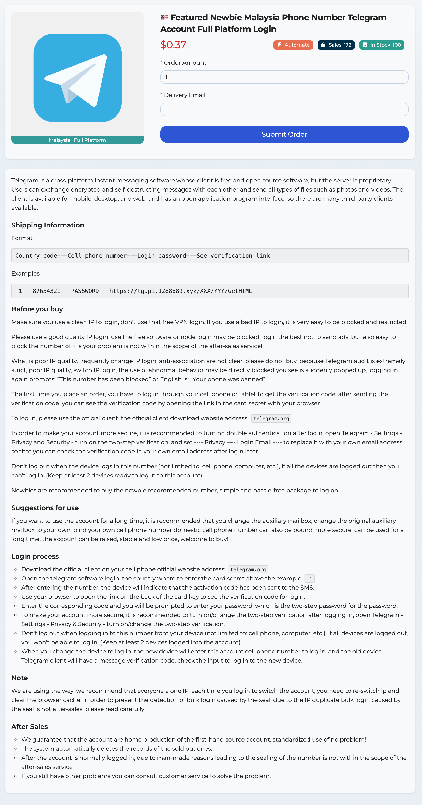

# 2024 Latest Free Telegram Account Full Platform Login &amp; tdata Protocol Login

Website: [https://allshop.vip](https://allshop.vip/?_referrer=ghkdmmz92)



Telegram is a cross-platform instant messaging software whose client is free and open source software, but the server is proprietary. Users can exchange encrypted and self-destructing messages with each other and send all types of files such as photos and videos. The client is available for mobile, desktop, and web, and has an open application program interface, so there are many third-party clients available.

### Shipping Information for Full Platform Login

Format

```
Country code---Cell phone number---Login password---See verification link
```

Examples

```
+1---87654321---PASSWORD---https://tgapi.1288889.xyz/XXX/YYY/GetHTML
```

### Shipping Information for tdata Protocol Login

Format

```
Protocol Login File Zip Link
```

The name of the zip file is the login cell phone number with the country code, and if there is a `twoFA.txt` file, it contains the secondary authentication password for login.

The decompressed file contains both tdata and session/json protocol number file formats, which can also be used for aircraft protocol software tools, the file list is as follows:

- 187654321.zip
  - tdata/
  - 187654321.json
  - 187654321.session
  - twoFA.txt

The session/json protocol number file is used for developers to use for batch login, users who don't use this kind of login method can not care about it.
